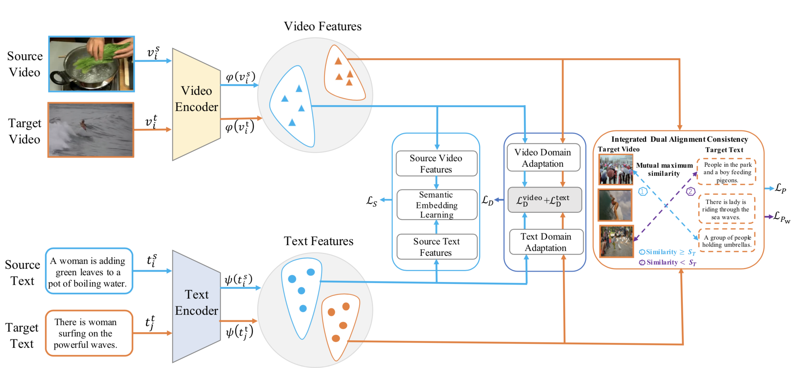
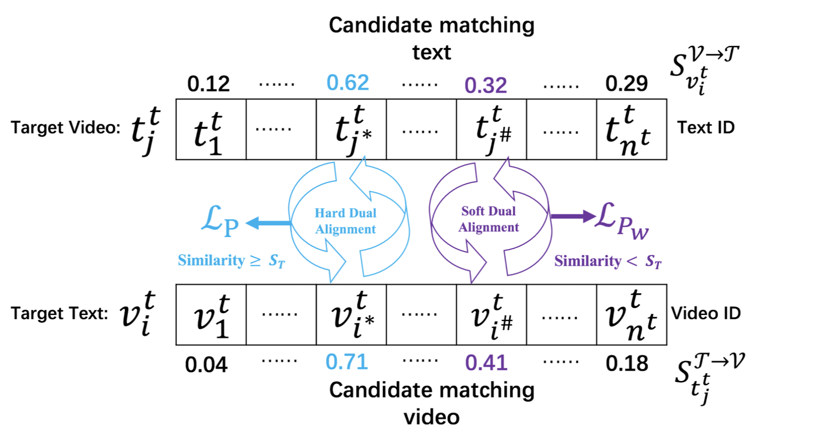
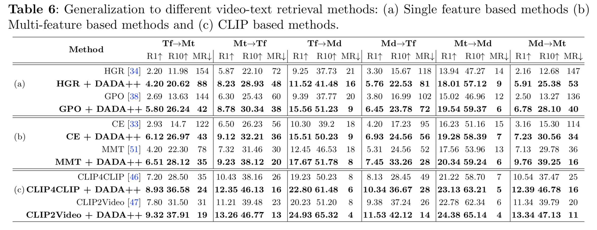

<h1 align="center">DADA++: Dual Alignment Domain Adaptation for Unsupervised Video-Text Retrieval</h1>
<p align="center">
<a href="">.svg" ></a>
<h4 align="center">This is the official repository of the paper <a href="">DADA++: Dual Alignment Domain Adaptation for Unsupervised Video-Text Retrieval</a>.</h4>
<h5 align="center"><em>Xiaoshuai Hao, Haimei Zhao, Hui Zhang, Weiming Li， Rong Yin，Wanqian Zhang, and Jing Zhang</em></h5>
<p align="center">
  <a href="#news">News</a> |
  <a href="#abstract">Abstract</a> |
  <a href="#method">Method</a> |
  <a href="#results">Results</a> |
  <a href="#preparation">Preparation</a> |
  <a href="#code">Code</a> |
  <a href="#acknowledgments">Acknowledgments</a> |
  <a href="#citing">Citing</a>
</p>

## News

- **(2023/9/27)** DADA++ is coming.
- **(2023/2/28)** Dual Alignment Unsupervised Domain Adaptation for Video-Text Retrieval（DADA） is accepted to CVPR 2023.
## Abstract

Video-text retrieval aims at returning the most semantically relevant videos given a textual query, which is a thriving topic in both computer vision and natural language processing communities. This paper focuses on a more challenging task, i.e., Unsupervised Domain Adaptation Video-text Retrieval (UDAVR), wherein training and testing data come from different distributions. Previous approaches are mostly derived from classification-based domain adaptation methods, which are neither multi-modal nor suitable for retrieval tasks. They merely alleviate the domain shift while overlooking the _pairwise misalignment_ issue in the target domain, i.e., there exist no semantic relationships between target videos and texts. To tackle this, we propose a novel method named **D**ual **A**lignment **D**omain **A**daptation (**DADA++**). Specifically, we first introduce cross-modal semantic embedding to generate discriminative source features in a joint embedding space. Besides, we utilize the cross-modal domain adaptations to balance the minimization of domain shift in a smooth manner. Furthermore, we empirically identify the pairwise misalignment in the target domain, and thus propose the **i**ntegrated **D**ual **A**lignment **C**onsistency (**iDAC**). The proposed iDAC adaptively aligns the video-text pairs, which are more likely to be relevant in the target domain, by verifying their cross-modal semantic proximity reciprocally in both hard and soft manners. This enables that positive pairs are increasing progressively and the noisy ones will potentially be aligned in the whole training procedure. We also provide insights into the function of DADA++ through the lens of domain adaptation, explaining its superiority in a theoretical way. Compared with state-of-the-art methods, DADA++ achieves 9.4% and 8.5% relative improvements on R@1 under the setting of TGIF→MSR-VTT and TGIF→MSVD respectively, demonstrating its superior performance.

## Method
### The schematic diagram of DADA++

###  Illustration of integrated Dual Alignment Consistency (iDAC)


## Results

### Quantitative results


## Preparation
### Prerequisites
The code is built with the following libraries:
* Python 3.7
* Pytorch 1.4.0
* Transformers 3.1.0
* Numpy 1.18.1
### Data Preparation
* The official data and video links can be found at https://github.com/ArrowLuo/CLIP4Clip/.
* Pre-trained features on MSRVTT, TGIF, and MSVD datasets can be downloaded from https://github.com/cshizhe/hgr_v2t.

## Code
### Codes coming soon...

## Acknowledgments
Some components of this code implementation are adopted from HGR, GPO, CE, MMT, CLIP4Clip, and CLIP2Video. We sincerely appreciate their contributions.
* HGR: https://github.com/cshizhe/hgr_v2t
* GPO :https://github.com/woodfrog/vse_infty
* CE: https://github.com/albanie/collaborative-experts
* MMT :https://github.com/gabeur/mmt
* CLIP4Clip: https://github.com/ArrowLuo/CLIP4Clip/
* CLIP2Video: https://github.com/CryhanFang/CLIP2Video

## Citing

If you find DADA useful in your research, please kindly consider citing the following paper.
```
@inproceedings{hao2023dual,
  title={Dual Alignment Unsupervised Domain Adaptation for Video-Text Retrieval},
  author={Hao, Xiaoshuai and Zhang, Wanqian and Wu, Dayan and Zhu, Fei and Li, Bo},
  booktitle={Proceedings of the IEEE/CVF Conference on Computer Vision and Pattern Recognition},
  pages={18962--18972},
  year={2023}
}
```

## License
This project is licensed under the Apache-2.0 License.
